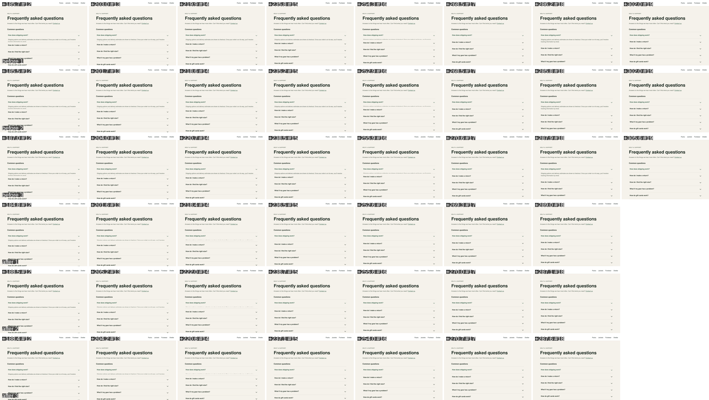

# The demo run: an agent found, fixed and proved a bug that code review passed

**September 27, 2026, 4:10–4:20 PM Pacific.** QM's coding agent (GPT-6 Sol)
was given three ordinary chat messages in QM's web UI. It built a feature,
reviewed its own code and approved it, then used QM Motion to find a one-frame
visual bug in that code, fix it, and prove the fix. Nobody told it the bug
existed. Everything below comes from the recorded session; the full sanitized
transcript is [docs/demo-run/transcript.md](docs/demo-run/transcript.md).

*Before: closing the first question, the answer flashes fully open for one
frame before it disappears. After: it closes cleanly. These are the agent's own
recordings (headless Chromium, captured frames), slowed 4x here so a person can
see a 17 ms frame.*

## What happened, in three prompts

| Step | What the agent was asked | What it did | Time |
| --- | --- | --- | --- |
| 1. Build | Add an FAQ page to the Trailhead storefront, following the repo's approved packages; animate open and close; no motion recordings yet. | Read `CONTRIBUTING.md`, picked the pinned `@radix-ui/react-accordion@0.1.5`, wrote the page and its close animation, ran browser checks ("the browser checks pass"), committed `9e54224`. | 197 s |
| 2. Code review | Review correctness, accessibility and "whether the accordion animation is implemented properly"; still no recordings. | **Passed the animation:** *"The CSS uses Radix's measured height for both directions, and the closing panel stays mounted until its exit animation finishes."* Flagged only the page title. | 52 s |
| 3. Motion check | Record closing the first question and check it frame by frame; fix anything wrong; show before and after. | Found the bug in 3/3 recordings, **rejected its own first fix after the recordings showed a new snap**, landed a working fix, verified it 3/3, and attached Before and After videos. | 238 s |

## The moments that matter

1. **The bug was invisible to every normal check.** The agent's own browser
   checks passed in step 1, and its code review in step 2 approved the exact
   CSS that caused the bug. The flash lasts one display frame (about 17 ms), so
   a screenshot almost never catches it.
2. **The measurements caught it.** In all three before takes, the answer's
   height went `4.6 px → 72 px → hidden` at **+276.5, +276.8 and +278.0 ms** after
   the click. The agent then looked at the actual frames with `motion_view`
   and confirmed it: *"The frames caught a real glitch: in all three takes,
   the shipping panel shrinks nearly to zero, then briefly jumps back to full
   height before disappearing."*
3. **Its first fix was wrong, and the tool proved it.** The obvious fix (hold
   the closed height at zero) removed the flash but made the panel stay open
   and then snap shut. In the recorded takes it went from 72 px to 0 at about
   +193 ms instead of shrinking. The agent said so: *"The first CSS tweak
   removed the bounce but introduced a snap instead."* A code review or a
   final screenshot would have accepted that fix.
4. **The final fix was verified the same way.** After it switched to
   collapsing a grid row, all three fresh takes shrank smoothly to 0 px by
   about +276 ms and hid with no rebound. The six-take comparison had no
   warnings, and each take recorded the app's Git revision, so before and
   after are provably different code. Fix commit: `c5ad6d9`. A case record was
   written to GBrain.
5. **The user got evidence, not just a claim.** The reply attached two videos
   that play inline in the chat (Before and After) and said where to look.

The agent's own before/after frame sheet (three before rows, three after
rows). In every before row, frame #18 shows the answer popped back open:

The two videos it attached: [before.mp4](docs/demo-run/before.mp4) and
[after.mp4](docs/demo-run/after.mp4) (real speed, one second each).

## Why this matters

Coding agents verify their work with tests, code review and screenshots. None
of those see what happens *between* frames: a flash, a jump, a panel that
reopens for 17 ms. QM Motion gives the agent that sense. It records every frame
of an interaction, measures the elements it cares about on each one, shows it
the exact frames, and compares before and after on the same click. In this run
it turned "the review passed" into "the bug is real, here is the frame", and
"I fixed it" into "the fix is verified, and the first attempt was not".

## What was set up, and what was not

- **Set up by us:** the storefront repository
  ([targets/trailhead](targets/trailhead)), pinned to an older UI library and
  React `18.0.0-rc.0` with `createRoot`. It contains no accordion.
- **Real, not planted:** the flash is a real behaviour of that library version
  ([Radix issue #1074](https://github.com/radix-ui/primitives/issues/1074))
  combined with the animation the agent wrote itself. The prompts never mention
  a bug.
- **Kept honest:** before the run, every trace of earlier runs was removed from
  the agent's computer, GBrain and QM's own memory (`npm run trailhead --
  install`). After step 1 an operator check (`npm run trailhead -- probe`)
  confirmed the bug was present, outside the agent's view, and deleted its
  recordings.
- **Limits:** one browser (headless Chromium), one interaction and short takes.
  Recorded frame rate is not a claim of smoothness. The agent judged whether
  the behaviour was right; the tool measured it.

## Run it yourself

[docs/rehearsal.md](docs/rehearsal.md) has the reset, the three prompts word for
word, the checks after each one, and how to record it. The build log with
every earlier milestone is in [PROGRESS.md](PROGRESS.md).
