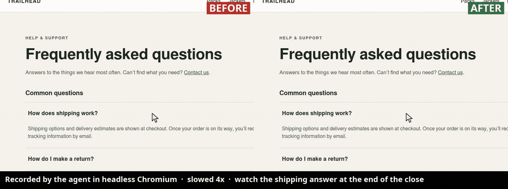

# QM Motion

## ▶ See it work: [the demo run](DEMO-RUN.md)



In three ordinary chat messages, QM's coding agent **built an FAQ page, approved
its own code in review, then used QM Motion to find a one-frame flash in it**
(the answer went 4.6 → 72 px → hidden at +277 ms, in 3 of 3 recordings). Its
first fix was wrong, and the recordings showed that too. The fix it kept was
verified clean in 3 of 3 takes, and it handed the user Before and After videos.
Nobody told it the bug existed. **Read [DEMO-RUN.md](DEMO-RUN.md)** for the
highlights, or the full [transcript](docs/demo-run/transcript.md).

Give QM's coding agent intermediate visual evidence so it can investigate a web
interaction, fix the application, and verify the result over time. GBrain keeps
concise evidence-backed cases. Built and verified on September 27: the
`motion` CLI (capture, inspect, compare with before/after videos for the
user), the `motion_view` core patch, the agent skill, and an end-to-end
agent-built demo (see [docs/rehearsal.md](docs/rehearsal.md)).

**New here?** Read [the product in plain words](docs/brief.md#in-plain-words)
first. What existed before the hackathon build window is disclosed in
[starting-point.md](docs/starting-point.md).

**Run the demo.** [docs/rehearsal.md](docs/rehearsal.md) is the step-by-step
runbook: reset to a leak-free state (`npm run trailhead -- install`), watch the
page live over Tailscale (`npm run preview -- start`), the three prompts to
paste into QM, the checks after each one (`npm run trailhead -- probe`), and
how to record and present it.

## Run on Linux; access over Tailscale

Verified on Linux x86_64 with Docker + Compose, Node 25 (24+ required), npm,
Python 3, Git, curl, OpenSSL, and host Chromium at `/usr/bin/chromium`.
An OpenAI API key with GPT-6 Sol access is required. Existing local credentials
are configured in ignored files; subscription logins are not API credentials.

```bash
# On this already bootstrapped machine:
npm start
# Generate the sign-in link here; open it in your Mac browser:
(cd deployment && ./node_modules/.bin/qm admin-login)
```

On this deployment, open **https://charlies-pc.tail1d1ed7.ts.net** from a device
on the same Tailscale network. Linux runs the services; a Mac can use the web UI
without a local install or SSH tunnel. See [sign-in from your Mac](docs/setup.md#sign-in-from-your-mac)
for QM's existing administrator login. `npm run login` still opens Chromium
on the Linux box. Do not copy temporary sign-in links into documentation or chat.

On a fresh Linux machine, first set `publicUrl` in `deployment/qm.config.jsonc`
to that machine's address (`https://localhost:8443` for desktop-local access).
Run `npm run bootstrap`, populate `OPENAI_API_KEY` in the generated, ignored
`deployment/.env`, then run the commands above. Bootstrap
downloads/builds pinned dependencies and generates local secrets. See
[setup](docs/setup.md) before moving an existing deployment to another machine.

```bash
npm run status       # QM, support services, and actual agent computer
npm run smoke        # real model, execution, capture, vision, durable memory
npm run smoke:ui     # normal web input, agent execution, and visible reply
npm run demo         # start the pinned target inside the QM computer
npm run demo -- check
npm stop             # retains databases and computer workspaces
```

Smoke creates the computer if needed, uses billable model calls, and briefly
restarts this project's GBrain/PostgreSQL services. The demo URL is
`http://localhost:4173` **inside the computer**. Its original Field Notes app
reproduces a historical Radix accordion defect; no repair is prewritten.

## Current foundation

- QM CLI 0.1.12, pi harness, OpenAI **GPT-6 Sol** (low effort setup baseline),
  durable local Docker computer.
- Stock Chromium, agent-browser 0.38.1, Playwright 1.63.0, FFmpeg; real PNG,
  short recording, and contact sheet verified inside that computer.
- GBrain 0.59.0.0 HTTP service with separate PostgreSQL and a source/prefix
  scoped OAuth thin client; real agent write and fresh-turn retrieval survive
  a normal service/database restart. Keyword retrieval needs no embedding key.
- Shared AGENTS.md / symlinked CLAUDE.md, selected Matt Pocock developer skills,
  and two separately deployed runtime skills.

How it fits together (your Mac → Tailscale → QM on this Linux box → the
agent's computer) is in [the system in one picture](docs/architecture.md#the-system-in-one-picture).
Read [PROGRESS.md](PROGRESS.md) for exact evidence and limitations,
[docs/plan.md](docs/plan.md) for the 225-minute implementation sequence, and
[docs/demo.md](docs/demo.md) for reproduction and reset. Architecture,
provenance, licenses, and optional later releases are in [docs/](docs/).

The build log with evidence for every milestone and rehearsal is in
[PROGRESS.md](PROGRESS.md); limits and deferred work are in
[docs/roadmap.md](docs/roadmap.md).
