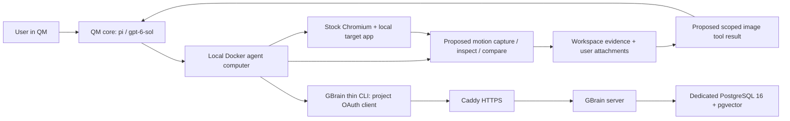

# Architecture

This is the selected architecture, with proposed product operations explicitly
marked below. [PROGRESS.md](../PROGRESS.md) owns the live verification status.

## Ownership and deployment

| Responsibility | Owner and choice |
| --- | --- |
| Agent decisions, code edits, scope/policy, conversations | QM, `pi` harness, OpenAI `gpt-6-sol` |
| Runtime and deployment lifecycle | Pinned `@yc-software/qm@0.1.12` CLI, digest-pinned images, and two small tracked core patches |
| Execution and rendering | Explicit `sandbox.backend: local`; custom sandbox image contains QM's execution daemon, stock Debian Chromium, FFmpeg, agent-browser 0.38.1, Playwright 1.63.0 |
| Capture/inspection/comparison and evidence delivery | Our future TypeScript extension; agent-browser capture plus minimal FFmpeg analysis |
| Durable case records | Separate GBrain 0.59.0.0 server and dedicated PostgreSQL service |
| HTTPS access | Tailscale Serve exposes QM privately at `https://charlies-pc.tail1d1ed7.ts.net`, proxying to portal port 8081. Caddy retains loopback QM port 8443 and Docker-local GBrain at `https://gbrain.qm.internal:3443`. |

`deployment/` is the CLI-managed deployment directory. `.upstream/qm/` is a
pinned reference checkout, not the running core. `deployment/runtime/` is an
image-overlay build context accepted by `qm up --build-from runtime`, not a
QM source fork. Its core Dockerfile applies the tracked
[local-core-address.patch](../deployment/runtime/patches/local-core-address.patch)
to the original digest-pinned core image; the other overlay Dockerfiles retain
their original images. The one-line fix passes `QM_CORE_CONTAINER` through
`localSandboxEnv`, allowing core to address the local computer's execution
daemon. Upstream passed it only through the AWS environment. The rebuilt core
has passed actual agent command execution with independently verified output.

The [request retry patch](../deployment/runtime/patches/model-request-retry.patch)
configures Pi 0.82.0's existing provider settings: 60-second request timeout and
one retry before response headers. This addresses observed long waits after
tool execution without replaying completed tools or changing security. Outer
session retry behavior is unchanged; the smoke helpers bound their whole run
at 240 seconds. Intermittent provider latency is not a motion-product feature.

CLI 0.1.12's runtime catalog lacks `gpt-6-sol`, although the newer reference
source includes it. The supported administrator model registry loads
[model-gpt-6-sol.json](../deployment/model-gpt-6-sol.json), using `gpt-5.5` as
the integration template and `gpt-6-sol` as the actual model ID. Real generation
has verified that registration. It is not a substitution of the selected model.

A future harness change must likewise be tracked against its exact source or
image base, then built and deployed to core. Building only a sandbox layer
cannot change core tool delivery. Pins and license boundaries are in
[references.md](references.md).

The agent computer runs the target server and Chromium together so target
`localhost` means the same machine. Browser guidance selects this local path.
No remote browser subscription is needed. Durable computer storage belongs to
QM; normal project stop preserves it and the GBrain database.
Stock Chromium `154.0.8037.57` in the actual computer has produced a real PNG,
3.1-second recording, and contact sheet; this verifies capture dependencies,
not model delivery of captured evidence. Upstream `qm check --live` has no
Docker implementation and exits 2; project smoke checks verify this path.

## Proposed motion interface

These names describe our planned operations; they are **not existing QM APIs**.

| Operation | Input | Output |
| --- | --- | --- |
| `capture` | URL, saved bounded interaction, reset/setup, viewport, duration | Run ID, recording, action timestamps, manifest |
| `inspect` | Run ID, optional time range and region | Bounded timestamped frames/contact sheet, measurements, evidence references |
| `compare` | Before/after run IDs with the same interaction | Trigger-aligned side-by-side frames, measured differences, comparability notes |

Start with agent-browser's native recording/contact-sheet support. Use FFmpeg
for extraction, crop, and composition before considering another analysis
dependency. Keep selection small enough for vision context (initial target:
one contact sheet or 4–8 frames). Include the launch and settle intervals so a
brief flash is not removed by change-based frame selection.

A proposed run directory in the computer's durable workspace is
`artifacts/motion/<run-id>/`, containing `manifest.json`, `capture.webm`, and
derived images. The manifest records app commit plus dirty patch identity,
browser/version, viewport/device scale, URL, initial state, reset procedure,
interaction steps, trigger/action times, available capture/frame times, and
artifact hashes. Preserve actual timing; distinguish encoded presentation
timestamps and estimated times from observed capture times. Do not reconstruct
precise browser timing solely as `frameIndex / requestedFPS`.

Copy/export presentation evidence through supported QM attachments, retaining
the durable workspace reference and digest. Host smoke evidence lives under
ignored `artifacts/`; raw recordings and browser profiles never enter Git.
GBrain cases reference retained evidence rather than embedding videos.

## First product dependency: image delivery

In the **actually deployed CLI 0.1.12 core image with our two patches**:

- `src/harness/agent-tools.ts:978` defines `read({path})`; line 1002 returns
  text content. Local `src/sandbox/local-sandbox.ts:468` provides binary reads,
  while line 473 converts file bytes to UTF-8 for ordinary `read`. Reading a
  PNG this way is not a vision proof.
- `src/harness/pi-harness.ts:1577` registers pi custom tools. Lines 2200–2204
  convert incoming attachments to `{type: "image", data, mimeType}` blocks.
  This representation works for real attachments, not automatic tool output.
- `src/tools/primitives.ts:911` and `:1398` show existing binary sandbox reads.
  `agent-tools.ts:419` owns result logging/scope handling; non-text security
  screening is at lines 454–460. Preserve these controls.
- Runtime guidance loads through `read({path:"skill://environment-operation/SKILL.md"})`
  and the matching motion-workflow URI; both passed real agent reads.

The `.upstream/qm` checkout at `1562826691680bff053c47347e88f032c336d84f` is a
newer reference, not this deployed image. It reorganizes tools into `files`
and `skills` actions and has different line numbers. Base a runtime patch on
the pinned image's actual source, not an assumed matching checkout.

The smallest proposed bridge is a scoped `motion` evidence-read tool: resolve a
run-owned image through the existing computer/scope context, validate allowed
path/MIME/size, return text metadata plus pi image content, and persist an
artifact reference rather than base64 in transcripts. Keep unrelated file
reads unchanged. Inspect model-session logging and replay for image-byte
retention before deployment. A real turn must describe withheld visual facts
from the returned image; filename echoes do not pass. Missing, oversized,
out-of-scope, or invalid images must fail clearly. This bridge is unimplemented.

## Memory and comparison boundaries

Use one deliberate GBrain route: the documented central HTTP server and thin
CLI. The project client gets `read write`, source `qm-motion`, and write prefix
`cases/`. Reads are isolated by source; prefixes constrain writes, not reads.
The sandbox receives only that client configuration, never database credentials
or the administrator OAuth grant. A real thin-client `whoami` confirms its
source/prefix and `read write` scope. The server uses
`https://gbrain.qm.internal:3443`: `.localhost` names resolved to loopback in
the client instead of the Docker service. Embeddings are disabled through
GBrain's supported no-embedding mode, with no embedding API dependency;
keyword retrieval is the initial contract. Semantic
search and synthesis are not claimed by this setup.

The compact case contains request, app revision, reproduction/reset, observed
intervals, diagnosis, fix, verification, and evidence references. Write it
after visual reporting; retry independently if memory is down.

Reset before each take and align runs to the interaction trigger. Reject or
label changed viewport, browser, app state, or interaction. A diff measures
change, while the agent evaluates intent. Capture can affect performance;
nominal FPS cannot prove smoothness. Any optional layout-shift instrumentation
must retain click-induced movement instead of applying CLS's recent-input
exclusion. No automated motion-quality score is needed for the MVP.
