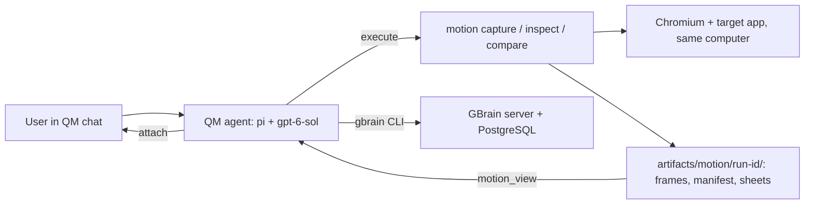

# Architecture

How QM Motion works, from the user's request down to the code. Everything we
build is **proposed** until [PROGRESS.md](../PROGRESS.md) records it working.
Terms such as turn, take, trigger and sheet are defined in
[brief.md](brief.md#terms).

## How it works, top down

The user asks QM's agent about a visual problem. In **one turn**, the agent:

1. **Captures** takes of the interaction: `motion capture` (run with QM's
   `execute` tool) drives Chromium in the agent's computer. It saves every
   screencast frame with Chrome's own timestamp, a per-frame **trace** of the
   watched elements' size, position and visibility, and a manifest.
2. **Inspects** a window around the trigger: `motion inspect` prints a short
   **table** from the trace (only frames where something changed) and builds
   one small sheet containing *every* frame in that window, labelled in ms
   from the trigger, optionally cropped.
3. **Reads, then sees**: the agent reads the table first, then calls the
   `motion_view` tool to see the sheet as pixels and confirm. Without
   `motion_view` the model gets only a file path.
4. **Diagnoses and edits** the application itself. How to fix is the agent's
   decision; the motion tools only provide evidence.
5. **Repeats and compares**: new takes from reset state, then `motion compare`
   builds a sheet aligned on the trigger; `motion_view` shows it.
6. **Reports**: optionally attaches sheets to its reply with QM's existing
   `attach` tool, and writes a short case to GBrain. A memory failure is
   reported and never blocks steps 1–5.

Images returned by a tool stay visible for the rest of that turn only (see
[image delivery](#image-delivery-verified-by-reading-the-code)). A later turn
must view the files again. The files themselves persist in the computer.

## What we build

Three pieces. Everything else already exists.

| Piece | What it does | Where it lives | How it reaches QM |
| --- | --- | --- | --- |
| `motion` CLI | `capture`, `inspect` and `compare` commands, run with `execute` | `src/motion/`, Node ES modules using the computer's Playwright 1.63.0 and FFmpeg | During development, copy it into `/root/workspace`. Once stable, bake it into the sandbox image ([rebuild caveat](#sandbox-image-changes)). |
| `motion_view` tool | Returns one evidence image to the model as an image block | `deployment/runtime/patches/motion-evidence-image.patch` against QM core | `npm start` rebuilds and deploys core |
| Agent guidance | Tells QM's agent the commands and evidence rules | `deployment/sandbox/skills/motion-workflow/SKILL.md` | `npm start` uploads it to core (`PUT /v1/deployment-layer`); applied within 30 s ([spec §8](spec.md#8-agent-guidance-deploymentsandboxskillsmotion-workflowskillmd)) |

**CLI interface (proposed).** Exact flags, file formats and errors are in
[spec.md](spec.md).

| Command | Input | Output |
| --- | --- | --- |
| `motion capture` | A saved scenario file (URL, viewport, ready condition, trigger target, elements to watch, recording length) and a label | Run ID; `artifacts/motion/<run-id>/` containing the frames, `frames.json` (Chrome timestamps), `trace.json` (per-frame values of watched elements) and `manifest.json` |
| `motion inspect` | Run ID, `--from`/`--to` in ms from the trigger, optional `--crop x,y,w,h` | A text table of changed trace values, plus one sheet PNG. Invalid windows fail clearly. |
| `motion compare` | The run IDs of the before takes and the after takes (three or more each), same window and crop | One table per take plus one sheet with one row per take, aligned on the trigger. Mismatched viewport, browser or URL is rejected. |

The scenario is data, not code: the tool knows nothing about Field Notes or
its bug. One scenario file for the Field Notes close interaction is enough for
the MVP.

**Size limits.** `motion_view` rejects images over pi's own read-tool limits:
2000×2000 px or 4.5 MB (precedent below). `motion inspect` and `compare` aim
for sheets of about 1 MB or less, and a turn should view only a few.

## Ownership and deployment

| Responsibility | Owner and choice |
| --- | --- |
| Agent decisions, code edits, scope/policy, conversations | QM, `pi` harness, OpenAI `gpt-6-sol` |
| Runtime and deployment lifecycle | Pinned `@yc-software/qm@0.1.12` CLI, digest-pinned images, and two small tracked core patches |
| Execution and rendering | Explicit `sandbox.backend: local`; custom sandbox image contains QM's execution daemon, stock Debian Chromium, FFmpeg, agent-browser 0.38.1, Playwright 1.63.0 |
| Capture/inspection/comparison and evidence delivery | Our `motion` CLI (raw CDP screencast through Playwright, FFmpeg sheets) and the `motion_view` core patch; see [What we build](#what-we-build) |
| Durable case records | Separate GBrain 0.59.0.0 server and dedicated PostgreSQL service |
| HTTPS access | Tailscale Serve exposes QM privately at `https://charlies-pc.tail1d1ed7.ts.net`, proxying to portal port 8081. Caddy retains loopback QM port 8443 and Docker-local GBrain at `https://gbrain.qm.internal:3443`. |

`deployment/` is the CLI-managed deployment directory. `.upstream/qm/` is a
pinned reference checkout, not the running core. `deployment/runtime/` is an
image-overlay build context accepted by `qm up --build-from runtime`, not a
QM source fork. Its core Dockerfile applies the tracked
[local-core-address.patch](../deployment/runtime/patches/local-core-address.patch)
to the original digest-pinned core image; the other overlay Dockerfiles retain
their original images. The one-line fix passes `QM_CORE_CONTAINER` through
`localSandboxEnv`, allowing core to address the local computer's execution
daemon. Upstream passed it only through the AWS environment. The rebuilt core
has passed actual agent command execution with independently verified output.

The [request retry patch](../deployment/runtime/patches/model-request-retry.patch)
configures Pi 0.82.0's existing provider settings: 60-second request timeout and
one retry before response headers. This addresses observed long waits after
tool execution without replaying completed tools or changing security. Outer
session retry behavior is unchanged; the smoke helpers bound their whole run
at 240 seconds. Intermittent provider latency is not a motion-product feature.

CLI 0.1.12's runtime catalog lacks `gpt-6-sol`, although the newer reference
source includes it. The supported administrator model registry loads
[model-gpt-6-sol.json](../deployment/model-gpt-6-sol.json), using `gpt-5.5` as
the integration template and `gpt-6-sol` as the actual model ID. Real generation
has verified that registration. It is not a substitution of the selected model.

A future harness change must likewise be tracked against its exact source or
image base, then built and deployed to core. Building only a sandbox layer
cannot change core tool delivery. Pins and license boundaries are in
[references.md](references.md).

The agent computer runs the target server and Chromium together so target
`localhost` means the same machine. Browser guidance selects this local path.
No remote browser subscription is needed. Durable computer storage belongs to
QM; normal project stop preserves it and the GBrain database.
Stock Chromium `154.0.8037.57` in the actual computer has produced a real PNG,
3.1-second recording, and contact sheet; this verifies capture dependencies,
not model delivery of captured evidence. Upstream `qm check --live` has no
Docker implementation and exits 2; project smoke checks verify this path.

## Capture (measured)

A spike on September 27, 2026 ran in the actual QM computer (Chromium
154.0.8037.57, 960×720, fresh navigation per run). An in-page logger recorded
each animation frame and the click; captured frames were matched by pixel
measurement and by eye. Evidence and scripts are in ignored
`artifacts/motion-spike/` on the host.

- **The rebound lasts exactly one frame.** The panel shrinks to 0.59px,
  reappears at 76.78px for one animation frame about 253–281ms after the
  click, then hides. It reproduced in every logged run, with or without
  capture.
- **agent-browser `record`** (0.38.1) uses CDP screencast frames that it
  acknowledges before taking the next one, piped into FFmpeg at a *fixed* frame
  rate (default 30, maximum 60). Its video repeats the latest frame, uses
  synthetic timestamps, and reports neither Chrome's frame times nor its start
  time. It caught the rebound in 13 of 14 runs at 60fps and 2 of 3 at 30fps.
  In the single `--contact-sheet` run, the sheet included the rebound tile.
  A skipped frame can hide the defect.
- **Raw CDP screencast** (Playwright CDPSession, `everyNthFrame: 1`, each frame
  acknowledged) caught it in 7 of 7 runs. Each frame carries a real wall-clock
  `metadata.timestamp`, directly comparable to the page's
  `performance.timeOrigin + event.timeStamp`. A frame lands about one display
  frame (9–28ms) after the page state it shows. Only about 20 frames arrive
  when nothing repaints, so idle intervals are sparse by design.
- **Trace screenshots** caught it in 5 of 5, but they are downscaled to
  498×374. agent-browser's `trace` records no screenshots.
- **Slow motion does not help.** `Animation.setPlaybackRate` at 0.5×, 0.25×
  and 0.1× still reproduces the rebound, but it remains one frame on screen.

**Decision.** `motion capture` is a small Playwright script using the raw CDP
screencast. It does the reset, navigation, wait, trigger and frame recording
in one process, so the trigger and frames share one real clock, and Chrome's
frame timestamps are the manifest's timing source. agent-browser remains
installed for ad-hoc exploration; its constant-rate video is not timing
evidence. Record at least three takes per side and report takes that show no
defect. Show every frame in a window rather than sampling, because sampling can
skip a one-frame defect.

**Numbers first.** Each take also records a per-frame trace of the watched
elements, sampled in the page with `requestAnimationFrame`, so it uses the
page's own clock. The spike's logger did exactly this. In all 24 logged
agent-browser runs, across three consecutive frames the panel height went
under 1px (0 or 0.59px), then 76.78px, then hidden. The
trace is exact and cheap to read as text; the sheet confirms what numbers
cannot show. **Not adopted:** pausing animations and seeking to checkpoints.
The rebound happens right after the 250ms close animation ends (measured
253–281ms after the click), so seeking through the animation would likely show
a clean close. Seeking also does not fire `animationend` naturally.
Real-time capture is the primary method; seeking is on the
[roadmap](roadmap.md).

A proposed run directory in the computer's durable workspace is
`artifacts/motion/<run-id>/`, containing `manifest.json`, the screencast frames
with their timestamps, an optional assembled video for people, and derived
sheets. The manifest records app commit plus dirty patch identity,
browser/version, viewport/device scale, URL, initial state, reset procedure,
interaction steps, trigger/action times, available capture/frame times, and
artifact hashes. Preserve actual timing; distinguish encoded presentation
timestamps and estimated times from observed capture times. Do not reconstruct
precise browser timing solely as `frameIndex / requestedFPS`.

Copy/export presentation evidence through supported QM attachments, retaining
the durable workspace reference and digest. Host smoke evidence lives under
ignored `artifacts/`; raw recordings and browser profiles never enter Git.
GBrain cases reference retained evidence rather than embedding videos.

## Image delivery (verified by reading the code)

Source-read on September 27, 2026 from the running `qm-qm-motion-core`
container (`/app/src`, started as `node src/index.ts`, both tracked patches
present) and its bundled pi 0.82.0 packages. Paths below are in that source.

**The API accepts it (tested directly).** A direct Responses API call with
`gpt-6-sol` sent a PNG as `input_image` inside `function_call_output`, the
exact shape pi produces. The model read a withheld six-digit code correctly,
both when continuing by `previous_response_id` and when resending the full
history. The probe and result are in ignored
`artifacts/openai-tool-image-probe/`.

**pi's own path works too (tested inside core).** `pi-probe.mjs` ran in the
`qm-qm-motion-core` container, using the `pi-ai` copy that the agent loop
imports. It used a model object cloned from `gpt-5.5` as `gpt-6-sol`, as QM
does. After a real tool call, a `toolResult` message with a PNG image block
was sent back, and the model read a withheld code correctly. **Still
unexercised:** QM's `defineTool`/`recordResult` wrapper (pass-through by code
reading) and the `motion_view` patch itself.

**Already works, unchanged.** A tool that returns an image block reaches
GPT-6 Sol as pixels:

1. pi's agent loop copies a tool's `content` array verbatim into the
   `toolResult` message (`pi-agent-core/dist/agent-loop.js`,
   `createToolResultMessage`).
2. The Responses adapter converts tool-result `{type:"image"}` blocks into
   `input_image` data URLs inside `function_call_output` when `model.input`
   includes `"image"` (`pi-ai/dist/api/openai-responses-shared.js`,
   `convertToolResultOutput`). The top-level and nested pi-ai copies are both
   0.82.0 with identical code. `transform-messages.js` only downgrades images
   for non-vision models.
3. `gpt-6-sol` is registered from template `gpt-5.5` (`openai-responses`,
   input `["text","image"]`), and `cloneModel` copies `input`
   (`src/model/pi-models.ts:329`).
4. `recordResult` (`src/harness/agent-tools.ts:419`) logs only the joined text
   and returns non-text blocks untouched. Screening (`src/core/orchestrator.ts`
   ~3250) allows non-`external` provenance. Any new tool is `external`
   (`src/security/security-posture.ts:110`). Checked September 27: this
   deployment's posture is `auto` (no `HARNESS_SECURITY_POSTURE`, empty
   `security_postures` table), but `SECURITY_SCREEN_BACKEND=off` turns
   inbound screening off (`src/wiring.ts:760`,
   `resolution-service.ts:86`). So tool results are not screened at all and
   a `motion_view` image passes with no notice. If screening is ever enabled,
   an image result fails open: a `[NOT security-screened …]` notice is
   prepended, an audit record is written, and the image is kept. The approval, timing and runtime-barrier wrappers pass content
   through except on denial or cancellation.

**Why it is missing.** This is not a pi limitation. pi's own built-in `read`
(`pi-coding-agent/dist/core/tools/read.js`) returns image blocks and
auto-resizes images to at most 2000×2000 px and 4.5 MB
(`utils/image-resize-core.js`). QM turns off pi's built-in tools
(`noTools: "builtin"`, `pi-harness.ts:1595`) and supplies its own tool set,
which has no image-returning tool. pi's limits are the precedent for the
`motion_view` size cap.

**Missing.** Every path from a file to the model is text. `read`
(`agent-tools.ts:978`) returns `text(content)`, and `ToolContext` exposes only
text `read` (`src/tools/primitives.ts:218`); local byte reads exist below it
(`src/sandbox/local-sandbox.ts:468`). MCP is not a workaround:
`src/mcp/mcp-client.ts:91` keeps only text blocks and the wrapper returns
`text(out)`. The newer `.upstream/qm` reference at `1562826` also has no
tool-result image path, and its tools and line numbers differ; base patches on
the running image, not that checkout.

**Constraints `motion_view` must respect.**

- *Images last one turn.* The tape stores tool-result images as
  `{omitted: true}` without bytes (`pi-harness.ts` `stripImageBytes` and
  `tapeMessage`). Each turn builds a cold session (`createTurnSession`), and
  `rehydrateFoldImages` (`tape-fold.ts`) replaces omitted images with
  `[image removed …]` text. Only user attachments with an artifact reference
  come back. A later turn must call the tool again; evidence files persist in
  the computer. Keep capture → inspect → edit → repeat → compare in one turn
  where possible.
- *Keep images small.* `trimPayloadToByteBudget` elides old inline images when
  a request exceeds 18 MB (`src/core/attachments.ts:34`), but it only walks
  `content`, not `function_call_output.output`, so tool images are never shed.
  Hence the [size limits](#what-we-build) above.
- *Paths.* `sandbox.readFileBytes(handle, rel)` resolves under
  `/root/workspace` via the computer daemon's `/read` (base64 JSON, 120 s
  timeout). The demo copy and `artifacts/motion/` both live there.
- *Syntax.* Core runs TypeScript through Node type stripping; the patch must
  use erasable syntax only (no enums, namespaces or parameter properties).

**Proposed patch** (unimplemented): `deployment/runtime/patches/
motion-evidence-image.patch`, applied after the two existing patches by
filename order and touching different files.

1. `primitives.ts`: an optional `readBytes(path, signal)` on `ToolContext` that
   provisions the handle and calls `deps.sandbox.readFileBytes`. No skill,
   shared-file or memory paths.
2. `agent-tools.ts`: a `motion_view({path})` tool. It accepts only
   `artifacts/motion/<run>/<file>.png|jpg|webp` without `..`, checks magic
   bytes and the size limits, and returns text metadata (path, bytes,
   SHA-256) plus one image block. Missing, oversized, out-of-scope or invalid files return
   clear `isError` text. Register it in the `tools` list; all other reads stay
   unchanged.
3. Rebuild with `npm start` (`qm up --build-from runtime`). Confirm the patch
   text inside the running container and a healthy core before any turn.

Proof requires a real turn to report a withheld random code visible only in
the returned image, plus the four failure cases. Filename echoes do not pass.

## Deployment notes

**User-visible evidence.** In web conversations the `attach` tool stages up to
20 workspace files for the reply (`src/core/attachments.ts:124`). Checked in
the deployed web UI bundle on September 27: an attached file with an artifact
ID and an image type (PNG, JPEG, WebP, GIF, AVIF, BMP and a few others) is
shown inline as a clickable ``. Video gets a file card with a download
link, not a player. So attach sheets as PNG.

### Sandbox image changes

The `motion` CLI can be baked into `qm-motion-sandbox:0.1.12` like
agent-browser. Core caches the sandbox image ID once per process
(`local-sandbox.ts` `preflight`). After a rebuild, core must restart; the next
provision then removes and recreates the computer container
(`ensureContainer`), keeping the `/root` volume but killing running processes,
including a QM `background` demo server. For fast iteration, copy scripts into
`/root/workspace` and bake them in once stable.

To apply a rebuilt sandbox image:

1. Run `npm stop && npm start`. `stop.sh` stops every project container,
   core included, and `qm up` starts them again; this lifecycle already passed
   (PROGRESS.md). The new core process re-reads the image ID.
2. Run any agent command (for example a real turn that calls `execute`), so
   core recreates the computer from the new image.
3. Run `python3 scripts/computer.py --connect`. The recreated container lacks
   the `qm-motion-brain-clients` network, and `start.sh` only connects
   computers that existed when it ran. Confirm with
   `npm run computer -- gbrain whoami`; if the client is missing, run
   `python3 scripts/connect-gbrain.py`.

## Memory and comparison boundaries

Use one deliberate GBrain route: the documented central HTTP server and thin
CLI. The project client gets `read write`, source `qm-motion`, and write prefix
`cases/`. Reads are isolated by source; prefixes constrain writes, not reads.
The sandbox receives only that client configuration, never database credentials
or the administrator OAuth grant. A real thin-client `whoami` confirms its
source/prefix and `read write` scope. The server uses
`https://gbrain.qm.internal:3443`: `.localhost` names resolved to loopback in
the client instead of the Docker service. Embeddings are disabled through
GBrain's supported no-embedding mode, with no embedding API dependency;
keyword retrieval is the initial contract. Semantic
search and synthesis are not claimed by this setup.

The compact case contains request, app revision, reproduction/reset, observed
intervals, diagnosis, fix, verification, and evidence references. Write it
after visual reporting; retry independently if memory is down.

Reset before each take and align runs to the interaction trigger. Reject or
label changed viewport, browser, app state, or interaction. A diff measures
change, while the agent evaluates intent. Capture can affect performance;
nominal FPS cannot prove smoothness. Any optional layout-shift instrumentation
must retain click-induced movement instead of applying CLS's recent-input
exclusion. No automated motion-quality score is needed for the MVP.
